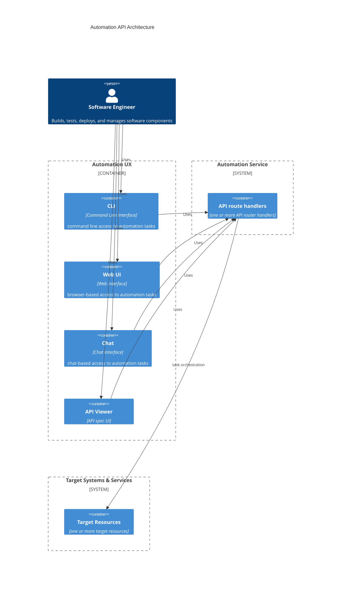

# The Missing DevOps/MLOps Automation Tooling
Automation capabilities across the software lifecycle provide key enablers for improved velocity while ensuring
quality and reliability.  Software lifecyle automation enables Continuous Integration/Continuous Delivery and DevOps
operational management, reducing the time spent on chores and underpinning safe systems of work.

Across the software stack there are multiple well known solutions for the different components and technlogies,
from Infrastructure as Code tools such as Terraform or StackQL to CICD services such as Gitlab-ci or GitHub Actions.
Those existing tools provide the back-bone capabilities for automation, however, software solutions often 
require an ensemmble of tooling unique to the organisational context and software componentry mix.

As a result, software engineering teams require 'glue' between those components to execute the common tasks needed
for day-to-day feature development and operational support.  This 'glue' can take forms ranging from expert knowlege
(Jane usually does that deployment) to work instructions and custom scripting.  Attention is required to this
'glue' to avoid fragile systems of work and dev effort being diverted to chores over new feature development.

This series will delve into an Automation API centered model for DevOps/MLOps automation tooling that provides the
`glue` for the different components across the software stack employing with a "team tasks" perspective to delivery
a domain specific language for building, testing, deploying, and operating production solutions.  The aim
is to enhance delivery velocity, reduce time spent on DevOps/MLOps chores, and simplify the learning curve
for new team members - systems that are easy to build and operate.

## Automation API Architecture
An automation API architecture employs a task driven design for codifying DevOps/MLops activities and chores that
enables toolbox flexibility across a range of user interfaces.

*TODO* replace this with a better looking diagram

### API Design
The Automation API architecture starts with defining the API routes to be supported.  This example API follows
a RESTful model, implementing the automation activities and resources.

This Automation API service will support two types of resources:
* `process`: Processes are started and stopped and have an unbounded duration
* `tasks`: Tasks are created/started and run to completion, having a bounded duration

The API spec is provided in the openapi.yml file.

---
*working notes*

Creating the tooling for building and managing software solutions enables
* reliability
* development velocity
* reducing cognitive overload
* reducing learning curve for new contributors
* increases developer productivty by removing chores
* extensible for multi-model interaction (web UI, chat, cli, scripts, etc)

complex systems - (micro-service assemblies) often require more than `python main.py` or `docker run`

## Scenario
As a software engineer
I want ready-made tooling for building, testing, deploying, and managing my software components
So that I can focus my efforts on feature development

As a software engineer,
I want to build features that don't require multiple reviews and rework
So that I don't require other team members to polish my contributions.

## Outline
1. designing the architecture and specifying an automation API - provides domain specific language for your solution - make devs fluent in your solution - dev & ops task focused
2. implement the domain automation service with swagger UI
3. implement the cli
4. implement the web ui
5. implement the chat ui

## Objectives
* enable use of the automation tooling logic and glue from multiple access points (UI, script, cli, chat)
* the individual components have loose implementation dependencies - building blocks
* doesn't require elaborte work instructions to complete tasks
* same outcomes running locally or remotely in CICD environment and deployments

## Principles
* Prod is just another environment deployment (with tighter access controls)
* Each dev gets thier own sandbox for feature development 

## Why not use the existing capabilities
Existing scripting and build tools
* cannonical linux stack - configure => make => make test => make install
* make, ant, maven, etc
* spiniker
* gitlab-ci / github-action
* AWS/Azure/GCP native cloud automation

A large selection of existing tooling exists, including:
* Infrastructure as Code - terraform, stackQL
* configuration automation - ansible & chef
* cli scription - make & ant
* deployment automation - spinnaker

Each provides features focusing on a porition of the end-2-end stack.
As the complexity grows (and most production systems are complex) each solution requires a unique stack
of tools and frameworks requiring additional glue and stitching - `how we do things here`
Especially so in the emerging space of MLOps which borrows from both application development, data science,
and data warehousing.

## License

This project is licensed under the MIT License. See the [LICENSE](LICENSE) file for details.